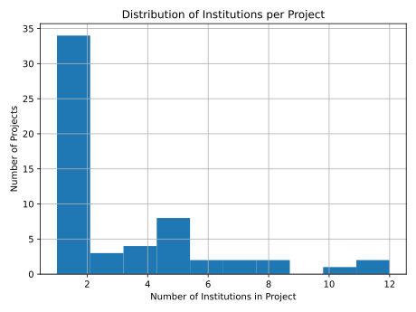

# Parse OSCARS website

A script to parse the OSCARS website to see which institutions have received funding from them.

Also creates a histogram of the number of institutions per project.



## Inputs

- pages: saved html from the 3 pages of the OSCARS website listing projects

## Outputs

- project_institutions.csv: csv with the institutions and the projects they are involved in
- projects: saved html from the projects
- projects.csv: csv with the projects and the number of institutions involved in each project
- institutions_per_project_histogram.svg: svg of the histogram of the number of institutions per project

How to run:

```bash
# Create virtual environment
python -m venv venv
source venv/bin/activate

# Install dependencies
pip install -r requirements.txt

# Get projects (creates projects/ folder with html files)
python get_projects.py

# Get institutions (creates project_institutions.csv)
python get_institutions.py

# Gather projects(creates projects.csv and institutions_per_project_histogram.svg)
python gather_projects.py
```
